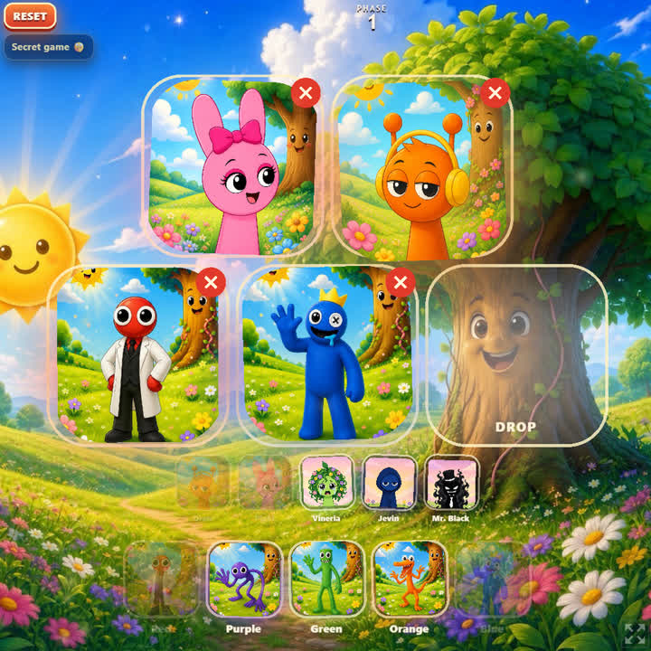
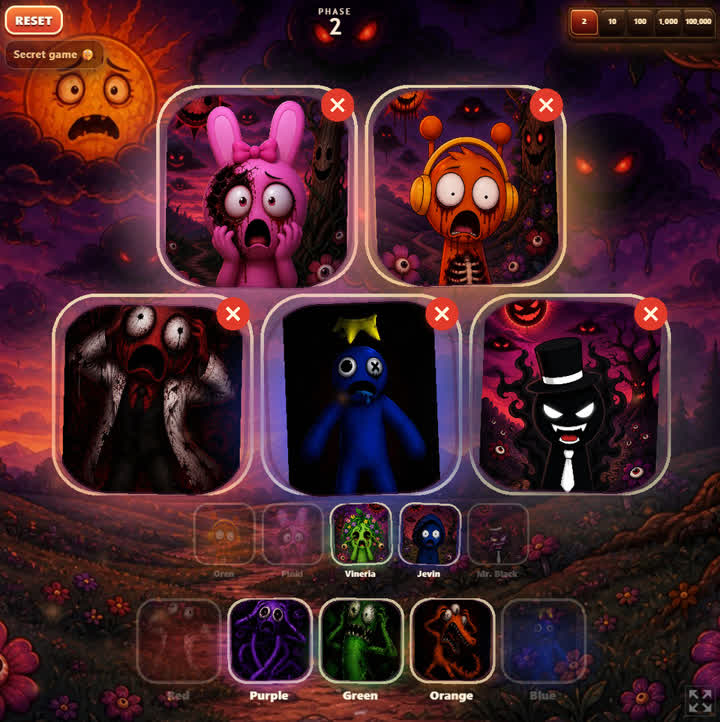
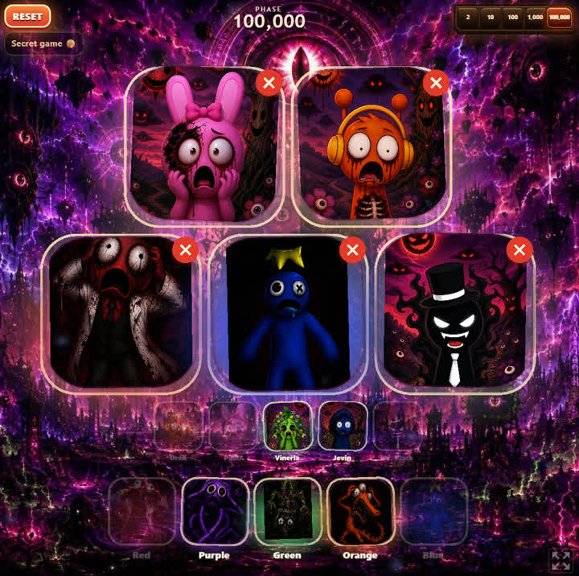
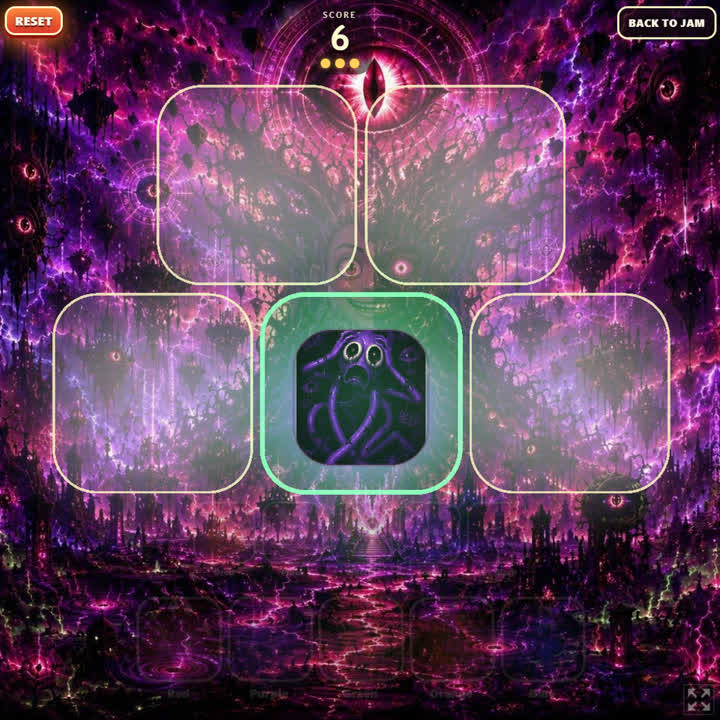

# Sprunki and Rainbow Friends Jam

**[▶ Play on GitHub Pages](https://sprunkijam.github.io/)** · **[Play on itch.io](https://sprunkijam.itch.io/sprunkijam)**

The **GitHub Pages** link opens the game directly in your browser. That usually works better than itch.io’s embedded player: sound plays more reliably, full screen uses more of the phone display, older devices run smoother, and high scores stick in storage more reliably. **itch.io** still plays great — handy if you already live there or want the itch.io page.

<p align="center">
  <a href="https://sprunkijam.github.io/"></a>
</p>

<p align="center">
  
  &nbsp;
  
  &nbsp;
  
</p>

---

Welcome to Sprunki and Rainbow Friends Jam, where every phase is a brand-new burst of fun. Phase 1 starts with cheerful Sprunkis bouncing around, Rainbow Friends exploring the meadow, and a sun that smiles just a little too enthusiastically — like it’s been waiting for this moment for a very, very long time. As the phases roll forward, the Sprunkis discover new sounds that get stranger and stranger, stacking into tunes that somehow feel both playful and… oddly organized. The sky changes colors in dramatic swirls, and Mr. Tree keeps striking poses. By the time you reach the highest phases, the sun has transformed into a giant eye watching over the world with friendly curiosity, and Mr. Tree’s exciting expressions settle into shapes that feel like inside jokes you’re not sure you were supposed to understand.

Everything stays bright, exciting, and full of surprises — just as Mr. Black planned.

Free to play in the browser. Works on **all modern web browsers**, on **smartphones and tablets**, and on **Windows, Mac, and Linux**.

Inspired by the *feel* of Sprunki / Incredibox drag-and-drop music toys. **Not affiliated** with Sprunki, Incredibox, or any fan wiki or mod. Every sprite, loop, and scare in this repo is original. Nothing was copied, scraped, or embedded from those projects.

## Play

1. Open the jam in a modern browser (phone, tablet, or desktop) — prefer **[GitHub Pages](https://sprunkijam.github.io/)** for the most reliable sound, full screen, and saves; **[itch.io](https://sprunkijam.itch.io/sprunkijam)** is a great alternate host.
2. Optional tips for sound and full screen are under **Sound & full screen help** on the TAP TO JAM title screen.
3. **Tap the title screen** to unlock audio (browsers block autoplay), then **TAP TO JAM**.
4. Drag friends from the tray onto the five big stage pads — Sprunki trio, **Jevin**, **Mr. Black**, and the Rainbow Friends (Red / Purple / Green / Orange / Blue).
5. Drop **Mr. Black** on any stage pad. Expect a cinematic hop into horror, then a loud stinger.
6. When Mr. Black is seated, use the phase dial (**2 / 10 / 100 / 1,000 / 100,000**) to mutate the mix. Smash **RESET** to return to the TAP TO JAM title screen.
7. After the jam starts, try **Secret game 🤫** under RESET — tap every glowing friend before they fade (later more light at once). Three misses ends the run; **BACK TO JAM** returns to the same stage. Highest score stays on this device.

Portrait and landscape both work. Portrait uses five pads (two on top, three below) and a two-row tray; landscape is five across when they stay tappable.

## Credits

Ideas and art direction by a 4-year-old kid. Built with Grok Bot.

Inspired by Sprunki / Incredibox. Not affiliated. Works on **all modern web browsers** — phones, tablets, and desktop.

<details>
<summary><span style="font-size: 1.5em; font-weight: 600; line-height: 1.25;">Developers</span></summary>

### Local network from a computer

```bash
npm install
npm run dev
```

Vite prints a LAN URL (`http://<your-computer>:5173`). On another device on the same Wi‑Fi: open that URL → **TAP TO JAM**.

For a production bundle (relative asset paths — works for itch.io and GitHub Pages):

```bash
npm run build
npm run preview
```

`npm run build` runs `npm ci`, typecheck, and `vite build --base=./` into `dist/`. `preview` serves that folder (default port **4173**). Same LAN trick.

### itch.io HTML5 zip

1. Run `npm run build`.
2. In Explorer, open **`dist`**, Select All, right-click → **Send to → Compressed (zipped) folder**.
3. Upload that zip as an HTML5 game. `index.html` must be at the zip root (siblings: `assets\`, `art\`, …).

Do **not** use PowerShell `Compress-Archive` — itch.io does not unpack nested folders from those zips correctly. Do not zip the `dist` folder as a single top-level directory.

### Scripts

| Command | What it does |
| --- | --- |
| `npm run dev` | Vite dev server, all interfaces |
| `npm run build` | `npm ci` + typecheck + production build into `dist/` with relative `./` base |
| `npm run build:absolute` | Same as build, but absolute `/` base (rarely needed) |
| `npm run preview` | Serve the built `dist/` locally |
| `npm run deploy` | `npm run build`, then `wrangler deploy` (legacy; Pages uses Actions) |

`npm run build` writes a static PWA to **`dist/`** with relative asset URLs. Push to `main` deploys GitHub Pages via Actions. No secrets, no backend, no env files, no third-party trackers.

### Tech

- Vite + TypeScript + PixiJS. **WebGL only** — no renderer menu, no WebGPU, no Canvas2D fallback. Works in modern browsers that can draw with WebGL (phones, tablets, Windows, Mac, Linux). If WebGL is missing, the title shows a short friendly note instead of a black screen.
- On Windows / desktop resize, the jam freezes on a static snapshot and **removes the live canvas** until the window settles (locked `--gpu-css-*`, `#stage-present` letterbox, one cached JPEG). A CSS `#stage-fill` cover of the same phase photo sits behind the letterbox so empty color bars do not show. Desktop Windows matches the Mac-class GPU budget (~2.16MP, DPR ≤ 2, sized from the real window box) and refits on idle after maximize / aspect flip. Huge stage JPEGs are runtime-capped on the Windows GPU upload only (files stay full-res).
- Ground shadows, pad pools, and friend blobs use one baked CSS-like radial falloff (stretched disc), not Pixi filters on every sprite and not stacked hard ovals. Drop-slot pools peek past every edge. Seated friends keep a friend-colored halo and the same gentle idle rock as the home row.
- Phase hops are organic radial blooms / wisps / shockwaves. WebGL uses one overlay Filter (GLSL ES 3.0). No full-stage filter on the jam world.
- Ambient dust motes (canvas-baked discs, ParticleContainer) start as warm meadow pollen and cool/slow as phases get stranger. Counts stay cheap on Windows; they pause with the resize-snapshot ticker.
- Original Web Audio stems (no copyrighted samples), bar-quantized scheduler, master limiter
- First-gesture unlock: silent HTMLAudio + `AudioContext.resume()` (mobile autoplay policy)
- Pointer Events drag with `setPointerCapture`, magnetic snap, overscroll blocked
- Viewport: `viewport-fit=cover`, `visualViewport` binding, `100dvh` / `100svh`, safe-area insets
- `navigator.vibrate` used when present; skipped where unavailable
- `translate="no"` so in-app translation doesn’t rewrite UI mid-jam
- PWA via `vite-plugin-pwa` + apple-touch-icon for Add to Home Screen
- Title screen, under **TAP TO JAM**: a quiet **build version** stamp only (no renderer suffix, no renderer menu).

</details>
